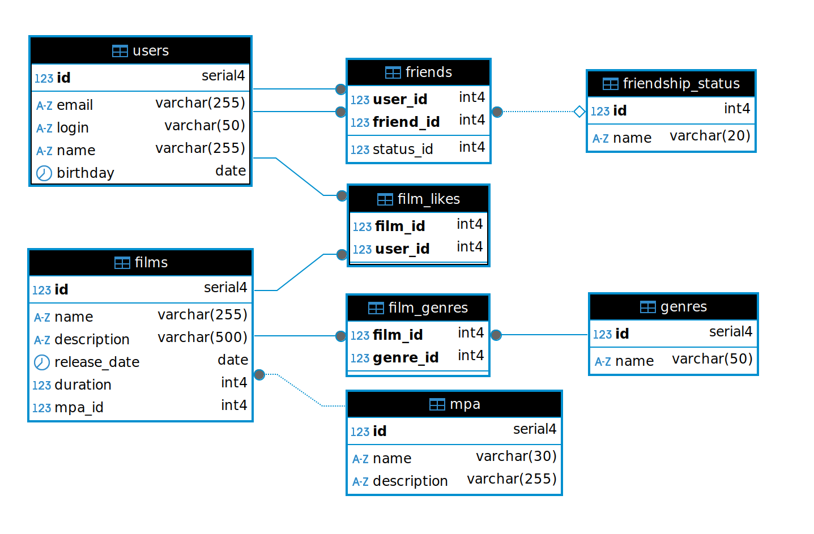

# Filmorate

## Схема базы данных



### Таблицы и связи

**mpa**

``` 
CREATE TABLE mpa (
    id          SERIAL PRIMARY KEY,          -- Автоинкрементный ID
    name        VARCHAR(30) NOT NULL UNIQUE, -- Название рейтинга (G, PG-13 и т.д.)
    description VARCHAR(255) NOT NULL        -- Описание рейтинга
);
```

- Связи:
  - `films.mpa_id` --> `mpa.id` (один рейтинг может быть у многих фильмов).


**films**

```
CREATE TABLE films (
    id           SERIAL PRIMARY KEY,     -- Уникальный ID фильма
    name         VARCHAR(255) NOT NULL,  -- Название фильма
    description  VARCHAR(500),           -- Описание (макс. 500 символов)
    release_date DATE NOT NULL,          -- Дата релиза
    duration     INT NOT NULL,           -- Продолжительность в минутах
    mpa_id       INT NOT NULL REFERENCES mpa(id) ON DELETE RESTRICT -- Ссылка на рейтинг
);
```

- Связи:
    - `mpa_id` --> `mpa.id` (каждый фильм имеет один рейтинг).
    - Связана с `genres` через `film_genres` (многие-ко-многим).

**genres и film_genres**

```
CREATE TABLE genres (
    id   SERIAL PRIMARY KEY,             -- Уникальный ID жанра
    name VARCHAR(50) NOT NULL UNIQUE     -- Название жанра (Комедия, Драма и т.д.)
);

CREATE TABLE film_genres (
    film_id  INT REFERENCES films(id)  ON DELETE CASCADE, -- Ссылка на фильм
    genre_id INT REFERENCES genres(id) ON DELETE CASCADE, -- Ссылка на жанр
    PRIMARY KEY (film_id, genre_id)      -- Составной первичный ключ
);
```

- Связи:
    - `film_genres` связывает `films` и `genres` (один фильм → несколько жанров).


**users**

```
CREATE TABLE users (
    id       SERIAL PRIMARY KEY,           -- Уникальный ID пользователя
    email    VARCHAR(255) NOT NULL UNIQUE, -- Email (уникальный)
    login    VARCHAR(50)  NOT NULL UNIQUE, -- Логин (уникальный)
    name     VARCHAR(255),                 -- Имя (может быть пустым)
    birthday DATE                          -- Дата рождения
);
```

- Связи: Связана с `friends` и `film_likes`.


**film_likes**

```
CREATE TABLE film_likes (
    film_id INT REFERENCES films(id) ON DELETE CASCADE,  -- Ссылка на фильм
    user_id INT REFERENCES users(id) ON DELETE CASCADE,  -- Ссылка на пользователя
    PRIMARY KEY (film_id, user_id)     -- Уникальная пара
);
```

- Назначение: Хранит лайки пользователей (один пользователь → много лайков).


**friendship_status и friends**

```
CREATE TABLE friendship_status (
    id   INT PRIMARY KEY,            -- ID статуса (1, 2)
    name VARCHAR(20) NOT NULL UNIQUE -- Название (REQUESTED, CONFIRMED)
);

CREATE TABLE friends (
    user_id   INT REFERENCES users(id) ON DELETE CASCADE,  -- Кто отправил запрос
    friend_id INT REFERENCES users(id) ON DELETE CASCADE,  -- Кому отправили
    status_id INT REFERENCES friendship_status(id) ON DELETE RESTRICT, -- Статус
    PRIMARY KEY (user_id, friend_id)                       -- Уникальная пара
);
```

- Связи:
    - `friends` ссылается на `users` дважды (дружба между двумя пользователями).
    - `status_id` --> `friendship_status.id` (статус дружбы).


### Типы данных ключевые понятия

- SERIAL = Автоинкрементный Integer (1, 2, 3…).
- VARCHAR(N) = Строка с максимальной длиной N.
- INT = Целое число (32 бита). 
- DATE = Дата (без времени).

### Ключевые понятия

- REFERENCES - гарантирует, что значение в столбце существует в другой таблице.


- ON DELETE
    - RESTRICT: Запрещает удаление записи, если на неё есть ссылки.
    - CASCADE: Удаляет связанные записи автоматически.

### Примеры данных

- Добавить рейтинги
```
INSERT INTO mpa (name, description) VALUES 
('G', 'Нет возрастных ограничений'),
('PG', 'Рекомендуется просмотр с родителями'),
('PG-13', 'Детям до 13 лет просмотр не желателен'),
('R', 'До 17 лет только с родителями'),
('NC-17', 'До 18 лет запрещено');
```

- Добавить жанры
```
INSERT INTO genres (name) VALUES 
('Комедия'),
('Драма'),
('Мультфильм'),
('Триллер'),
('Документальный'),
('Боевик');
```

- Добавить пользователей
```
INSERT INTO users (email, login, name, birthday) VALUES 
('user1@mail.com', 'user1', 'Иван Петров', '1990-05-15'),
('user2@mail.com', 'user2', 'Анна Сидорова', '1995-08-22'),
('user3@mail.com', 'user3', 'Петр Иванов', '1985-12-03'),
('user4@mail.com', 'user4', 'Мария Козлова', '2000-03-10');
```

- Добавить фильмы
```
INSERT INTO films (name, description, release_date, duration, mpa_id) VALUES 
('Форрест Гамп', 'История простого человека', '1994-06-06', 135, 1),
('Король говорит', 'Драма о короле Георге VI', '2010-11-25', 119, 1),
('Шрек', 'Мультфильм про огра', '2001-04-18', 90, 1),
('Терминатор', 'Научно-фантастический боевик', '1984-10-26', 107, 4);
```

- Связать фильмы с жанрами
```
INSERT INTO film_genres (film_id, genre_id) VALUES 
(1, 2), -- Форрест Гамп - Драма
(2, 2), -- Король говорит - Драма
(3, 3), (3, 1), -- Шрек - Мультфильм и Комедия
(4, 6); -- Терминатор - Боевик
```

- Добавить статусы дружбы
```
INSERT INTO friendship_status (id, name) VALUES 
(1, 'REQUESTED'),
(2, 'CONFIRMED');
```

- Добавить дружеские связи
```
INSERT INTO friends (user_id, friend_id, status_id) VALUES 
(1, 2, 2), -- Подтвержденная дружба между user1 и user2
(1, 3, 1), -- Запрос в друзья от user1 к user3
(2, 4, 2); -- Подтвержденная дружба между user2 и user4
```

- Добавить лайки
```
INSERT INTO film_likes (film_id, user_id) VALUES 
(1, 1), -- user1 лайкнул Форрест Гамп
(1, 2), -- user2 лайкнул Форрест Гамп
(3, 3), -- user3 лайкнул Шрек
(4, 4); -- user4 лайкнул Терминатор
```

### Пример запросов

- Получить список всех фильмов с рейтингами
```
SELECT f.name, m.name, m.description
FROM films f
JOIN mpa m ON f.mpa_id = m.id
ORDER BY f.name;
```

- Найти популярные фильмы (топ-3 по лайкам)
```
SELECT f.name, COUNT(fl.user_id) as likes_count
FROM films f
LEFT JOIN film_likes fl ON f.id = fl.film_id
GROUP BY f.id
ORDER BY likes_count DESC
LIMIT 3;
```

- Получить список всех пользователей с их друзьями
```
SELECT u1.name as user_name, u2.name as friend_name, fs.name as status
FROM users u1
JOIN friends f ON u1.id = f.user_id
JOIN users u2 ON f.friend_id = u2.id
JOIN friendship_status fs ON f.status_id = fs.id;
```

- Получить список фильмов, которые лайкнул конкретный пользователь
```
SELECT f.name
FROM films f
JOIN film_likes fl ON f.id = fl.film_id
WHERE fl.user_id = 1; -- ID пользователя
```

